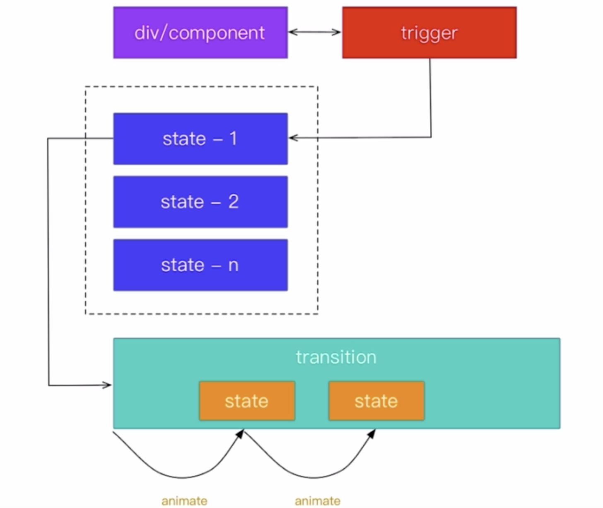

# angular动画





* Animate函数规定了具体怎么样过渡，比如时间、过渡的速度等，animate有多种重载方式。

* 在动画中，state定义状态。 [transition](https://angular.io/api/animations/transition#transition)定义了状态之间的过渡方法。


## 使用 

* 安装动画组件 

```
yarn add  @angular/animations@7.2.4
```

* 引入 组件app.module.ts

```typescript
import { BrowserAnimationsModule } from '@angular/platform-browser/animations';
```

* 引入函数app.component.ts,定义trigger、state、transition和对应的animate

```typescript
import { trigger, state, transition, style } from '@angular/animations';

@Component({
  selector: 'app-root',
  templateUrl: './app.component.html',
  styleUrls: ['./app.component.scss'],
  animations: [
    trigger('square',
      [
        state('green', style ({'background-color': 'green'})),
        state('red', style ({'background-color': 'red'})),
        transition('green => red', animate(1000)),
        transition('red => green', animate(1000))
      ]
    )
  ]
})
export class AppComponent {
  squareState = 'red';    //定义开始状态为red
  onClick() {
    this.squareState = this.squareState === 'red' ? 'green' : 'red';
  }
}
```

* 前端代码app.component.html,使用@square绑定trigger，squareState为变量名。

```html
 <div class="square" [@square]="squareState" (click)="onClick()">
```


## 动画效果

* 常用的动画效果有，匀速变化、cubic-bezier、和关键帧（keyframe）
* cubic-bezier 有如下2个网站能够帮我们实现，如``animate('0.8s cubic-bezier(0.445, 0.05, 0.55, 0.95)')``
  * https://easings.net/zh-cn  常用渐变
  * http://cubic-bezier.com/
* 关键帧（keyframe）定义动画路径上的关键帧语法如下：

```typescript
animate(5s, keyframes([
  style({transform: 'translateY(100%)'}),
  style({transform: 'translateY(90%)'}),
  style({transform: 'translateY(80%)'}),
  style({transform: 'translateY(20%)'}),
  style({transform: 'translateY(0%)'}),
]))
```

## 基本用法

```typescript
import {trigger, state, transition, style, animate , group} from '@angular/animations';

export const slideToRight = trigger('routeAnim', [
  // 没状态，一开始不存在
  state('void', style ( {  'position': 'fixed', 'width': '100%', 'height': '80%' })),
  state('*', style ( {  'position': 'fixed', 'width': '100%', 'height': '80%' })),
  transition('void => *', [
    style({transform: 'translateX(-100%)', opacity: 0}),
    animate('0.5s ease-in-out', style({transform: 'translateX(0%)'}))
  ]),
  transition('* => void', [
    style({transform: 'translateX(0%)', opacity: 1}),
    animate('0.5s ease-in-out', style({transform: 'translateX(100%)'}))
  ]),
  transition('out => in', animate('100ms ease-out'))
])

```


## group动画

group动画是指同时进行一组元素的动画。

```typescript
import {trigger, state, transition, style, animate , group} from '@angular/animations';

export const slideToRight = trigger('routeAnim', [
  // 没状态，一开始不存在
  state('void', style ( {  'position': 'fixed', 'width': '100%', 'height': '80%' })),
  state('*', style ( {  'position': 'fixed', 'width': '100%', 'height': '80%' })),
  transition('void => *', [
    style({transform: 'translateX(-100%)', opacity: 0}),
    group([
      animate('0.5s ease-in-out', style({transform: 'translateX(0%)'})),
      animate('0.3s ease-in', style({opacity: 1}))
    ])
    // animate('0.5s ease-in-out', style({transform: 'translateX(0%)'}))
  ]),
  transition('* => void', [
    style({transform: 'translateX(0%)', opacity: 1}),
    group([
      animate('0.5s ease-in-out', style({transform: 'translateX(100%)'})),
      animate('0.3s ease-in', style({opacity: 0}))
    ])
    // animate('0.5s ease-in-out', style({transform: 'translateX(100%)'}))
  ])
])

```


## Query & Stagger 

* Query用于父亲节点寻找子节点，然后把动画应用到选择的元素；

```typescript
import {trigger, stagger , state, transition, style, animate , group, query} from '@angular/animations';

export const listAnimation = trigger('listAnim', [
  transition('* => *', [
    query(':enter', style({ opacity: 0}),  {optional: true }),
    query(':enter', animate('1s', style({ opacity: 1})),  {optional: true }),
    query(':leave', style({ opacity: 1}),  {optional: true }),
    query(':leave', animate('1s', style({ opacity: 0})),  {optional: true })
  ])
])

```

* Stagger指有多个满足Querry的元素，每个元素之间有间隔。

```typescript
import {trigger, stagger , state, transition, style, animate , group, query} from '@angular/animations';

export const listAnimation = trigger('listAnim', [
  transition('* => *', [
    query(':enter', style({ opacity: 0}),  {optional: true }),
    query(':enter', stagger(100, [
      animate('1s', style({opacity: 1}))
    ]),  {optional: true }),
    query(':leave', style({ opacity: 1}),  {optional: true }),
    query(':leave', stagger(100, [
      animate('1s', style({opacity: 0}))
    ]),  {optional: true })
  ])
])

```

